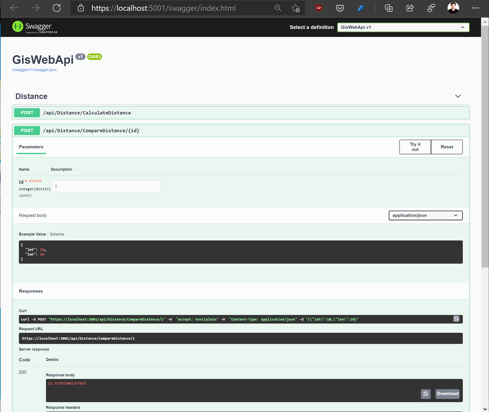

# EFCore PostGis Demo

This demo project shows how to host [PostGIS](https://postgis.net) inside a docker container and access it in a .NET 5 Web API via [EF Core](https://docs.microsoft.com/en-us/ef/core/).

See [postgis_service](./postgis_service.md) for how to run PostGIS docker container.

