# PostGIS Docker service

## Prerequisite

To use the development [PostGIS](https://postgis.net/) server & associated [pgAdmin web management](https://www.pgadmin.org/) service, you need:

- [Docker Desktop](https://www.docker.com/products/docker-desktop)
- [PowerShell v7+](https://github.com/PowerShell/PowerShell)

## Start PostGIS and connect database

### Start PostGIS docker 

To start **PostGIS** & **pgAdmin** docker compose service:

1. Make sure [Docker Desktop daemon is currently running when on Windows or macOS](https://docs.docker.com/docker-for-windows/install/#start-docker-desktop).

2. Run `dev_start.ps1` script in normal PowerShell session:
    ```powershell
    ./docker_postgis/dev_start.ps1
    ```
    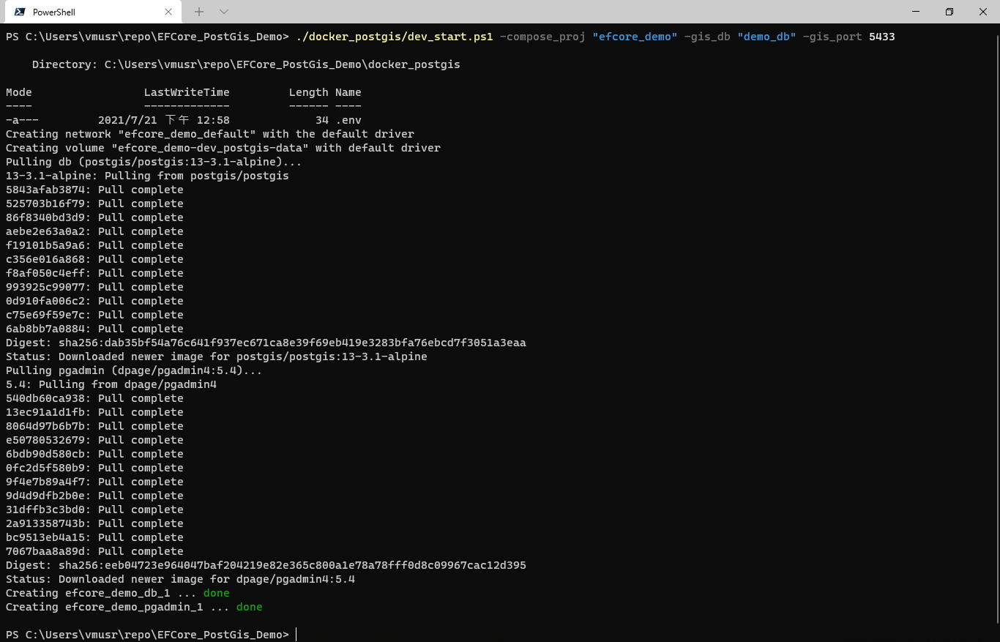

#### Inspect container status

Run `dev_ps.ps1` script to see current docker container status:  

```powershell
./docker_postgis/dev_ps.ps1
```

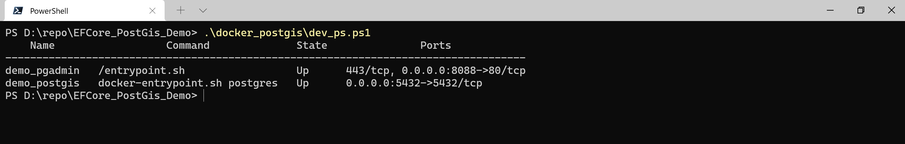

### Connect PostGis using pgAdmin

1. After startup the docker compose service, use browser app to open web page: `http://localhost:8088`:  
    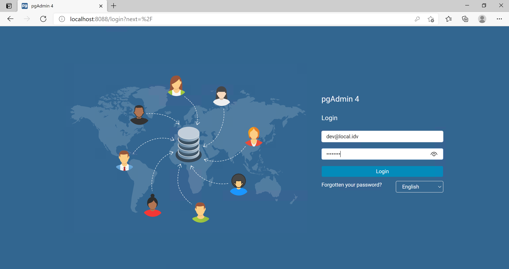  
   Enter `dev@local.idv` as Account, `pass1234` as password to login, which are the environment variables written inside the `dev.env` file as `{PGADMIN_USERNAME}@{PGADMIN_DOMAIN}` & `{PGADMIN_PASS}`:  
   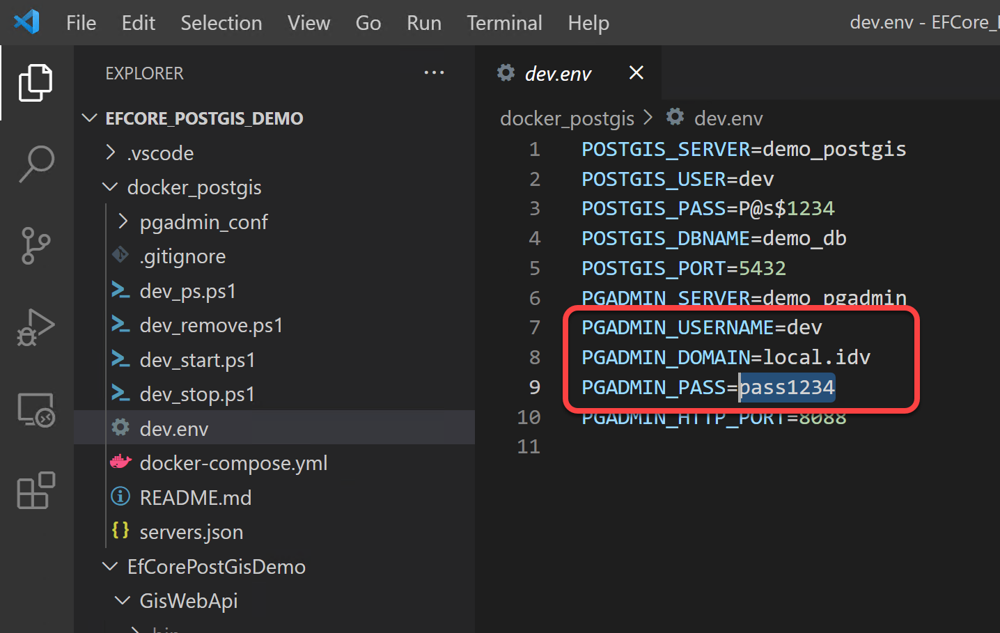  
2. Expand the left server list, it will prompt for PostGIS server connection's password:  
    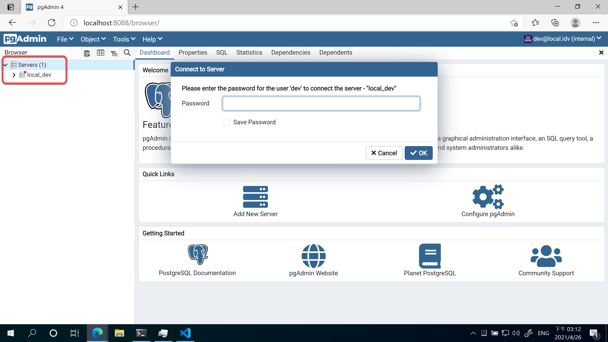  
3. Enter the password that written inside the `dev.env` variable file as `{POSTGIS_PASS}`:  
    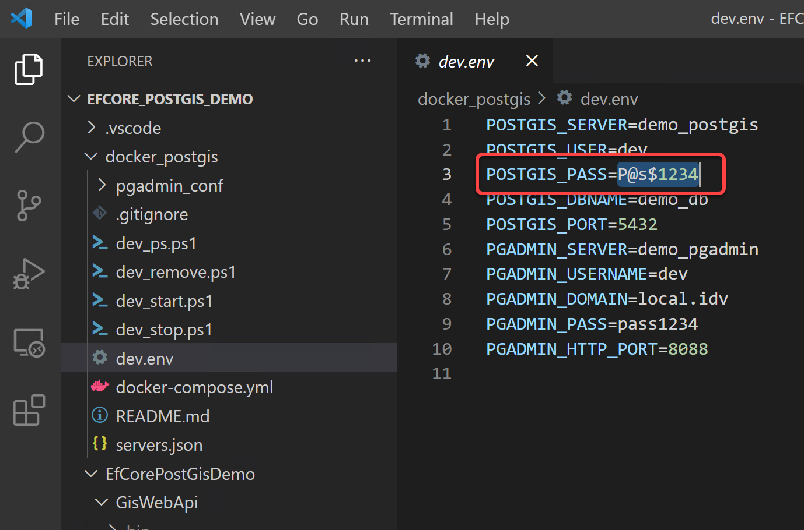  
   Check **Save Password** and then click OK:  
    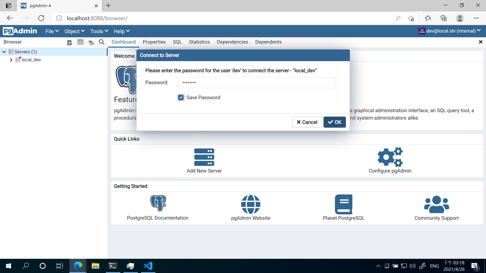  
4. pgAdmin connects to PostGIS services successfully:  
    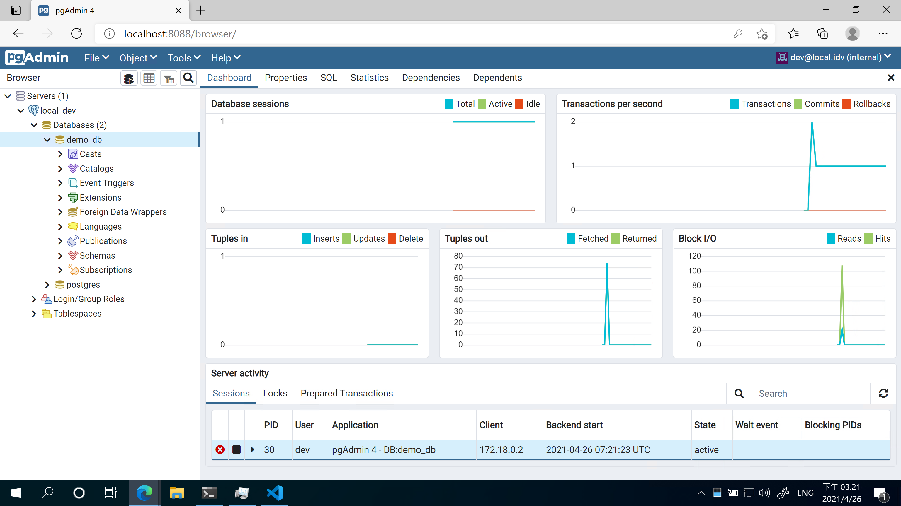

### Import/Export PostGIS database file via pgAdmin

Sometimes you need to get backup files of PostgreSQL in order to do Database backup/restore, via pgAdmin's [storage manager](https://www.pgadmin.org/docs/pgadmin4/latest/storage_manager.html):  
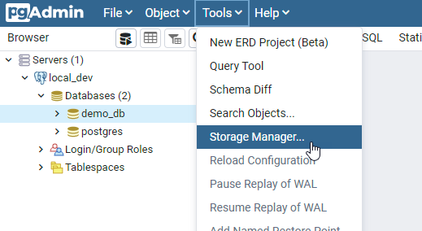  
Which is binding to docker mounted folder inside the `docker_postgis\pgadmin_conf\storage` folder within the `{PGADMIN_USERNAME}_{PGADMIN_DOMAIN}` subfolder:  
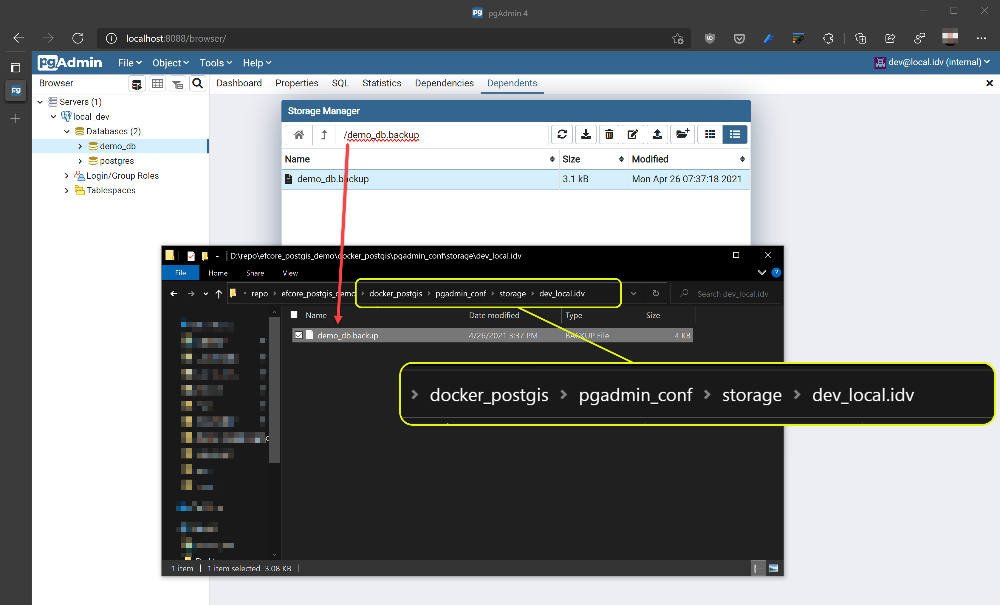   

## Stop PostGIS & pgAdmin

To stop **PostGIS** & **pgAdmin** docker compose service, Run `dev_stop.ps1` script in normal PowerShell session:

```powershell
./docker_postgis/dev_stop.ps1
```

Or you can stop the services composition entry in [Docker dashboard](https://docs.docker.com/desktop/dashboard/):
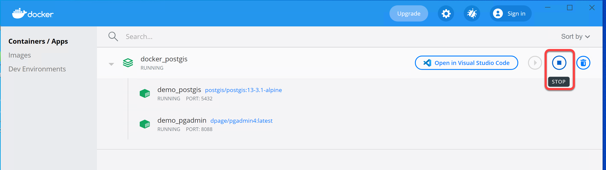
Then you can safely exit docker desktop daemon if on Windows or macOS.

## Remove PostGIS & pgAdmin services

If you need to reset the PostGIS server, run the `dev_remove.ps1` with additional parameters in normal PowerShell session:

```powershell
./docker_postgis/dev_remove.ps1 --volumes
```
